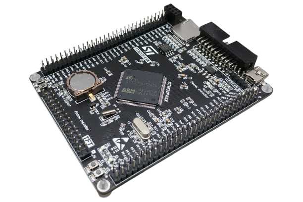
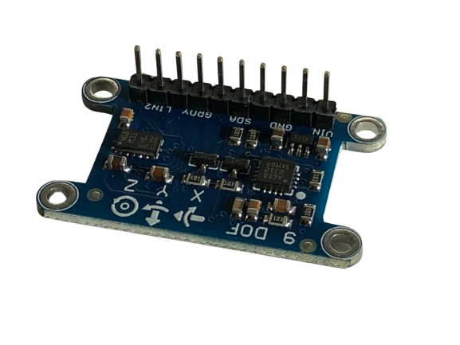
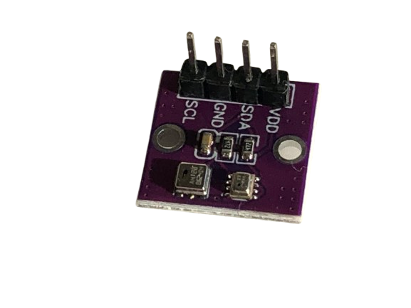

# DSP Lab 1

## Microcontroller Development Board 

I have chosen for this STM32F407VET6 development board because it has a similar chip that Phil uses on his custom DSP PCB. The STM32F407VET6 is a 32-bit ARM Cortex M4 microcontroller with DSP instructions. 
You can buy it for under 10 euro on AliExpress [here](https://nl.aliexpress.com/item/1005001644834573.html?spm=a2g0o.productlist.main.1.b3dfvfbwvfbwjK&algo_pvid=284cf71b-6d31-4386-967b-9a592789a6ec&algo_exp_id=284cf71b-6d31-4386-967b-9a592789a6ec-0&pdp_npi=4%40dis%21EUR%219.69%219.69%21%21%2110.30%2110.30%21%40211b613917306683684106493ef414%2112000016954060469%21sea%21NL%21822730915%21X&curPageLogUid=YsPn9uDHncoh&utparam-url=scene%3Asearch%7Cquery_from%3A). Keep in mind that it does not come with the [ST-Link V2 programmer](https://nl.aliexpress.com/item/1005005273159580.html?spm=a2g0o.productlist.main.1.6c237ebbPpzKEK&algo_pvid=ff7c7d71-3bb3-4e4b-a9d3-c35d70fd9b99&algo_exp_id=ff7c7d71-3bb3-4e4b-a9d3-c35d70fd9b99-0&pdp_npi=4%40dis%21EUR%212.57%212.40%21%21%212.73%212.55%21%402103917f17306684432736078ee21e%2112000032440955298%21sea%21NL%21822730915%21X&curPageLogUid=trNRV6dqMgo8&utparam-url=scene%3Asearch%7Cquery_from%3A) that you need. **Make sure** that you buy it if you do not own one.

## IMU Development Board 

I am using a board which is not really an integrated IMU sensor in 1 sillicon package, but instead a board which has 2 sensors assembled on it. The first sensor being the LSM303DLHC which is an accelerometer and magnetometer in one. The second sensor being the L3GD20 which is a gyroscope. You can find the AliExpress link [here](https://nl.aliexpress.com/item/32903832768.html?spm=a2g0o.productlist.main.9.3843115bjwHG4B&algo_pvid=7ba10ca8-d109-47c9-9cd3-4fb200163a69&algo_exp_id=7ba10ca8-d109-47c9-9cd3-4fb200163a69-4&pdp_npi=4%40dis%21EUR%215.59%215.59%21%21%215.94%215.94%21%402103835e17306675901261026ede18%2165798327221%21sea%21NL%21822730915%21X&curPageLogUid=4SDKWKGLpj4c&utparam-url=scene%3Asearch%7Cquery_from%3A). It uses i2c as a communication protocol. 

## Pressure Sensor Development Board

I am using the BMP280 digital pressure sensor developed by Bosch. This one can be widely ordered on AliExpress by various sellers. I have chosen to buy [this](https://nl.aliexpress.com/item/1005006733065626.html?spm=a2g0o.productlist.main.11.1945b4Ryb4Ryvj&algo_pvid=1eaab135-3305-4090-9e63-5ac73ac4ea28&algo_exp_id=1eaab135-3305-4090-9e63-5ac73ac4ea28-5&pdp_npi=4%40dis%21EUR%214.68%214.49%21%21%214.97%214.77%21%402103854017306672518593639ee944%2112000038122257904%21sea%21NL%21822730915%21X&curPageLogUid=bLYCUn4kQhUP&utparam-url=scene%3Asearch%7Cquery_from%3A) board because it also ships with the AHT20 temperature and humidity sensor which may come in handy in the future. The BMP280 development board only allows us to use i2c although the sensor supports spi as well.
